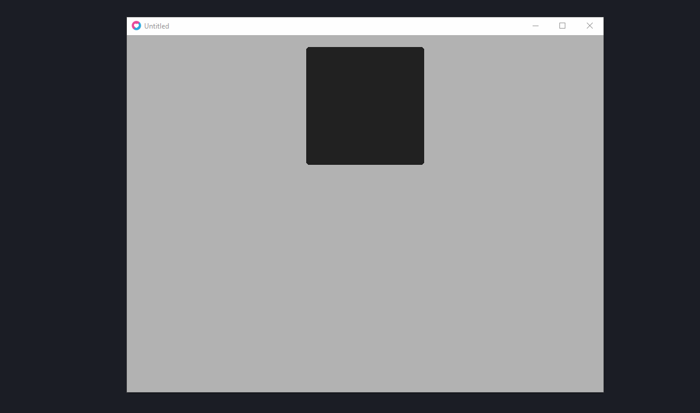

# Plan

`Plan` is a super simple layout helper designed for use with Love2d.

_Plan is in its early stages, may be full of bugs, and could easily change.
Use with caution!_

- [Usage](#usage)
- [Concepts](#concepts)
- [Example](#example)
- [API](#api)
  - [Plan](#plan-1)
  - [Plan.Container](#plancontainer)
  - [Plan.Rules](#planrules)
    - [Bundled Rules](#bundled-rules)
  - [Plan.RuleFactory](#planrulefactory)
- [Advanced Usage](#advanced-usage)

## Usage

`Plan` is designed to sit all within a single file, and can easily be thrown
into your lib folder:

```lua
local Plan = require "path.to.libs.plan"
```

Before jumping into the code, it'd be good to go over the basic ideas of the
library, and how they fit together.

## Concepts

At the core of `Plan` there are two objects, `Containers` - which are your
layout blocks, and `Rules` which determine where your Containers are positioned.

Containers are able to contain other Containers, and these children use their
own rules to determine their position _relative_ to its parent. By themselves,
Containers have no graphical component, hence the term "layout" helper, rather
than UI - there's still a bit of work ahead of you.

Let's look at an example.

## Example

Any layout managed by `Plan` requires a root. Calling `Plan.new()` will create a
new root whose dimensions take up the entire screen at the point of calling.

We'll also hook into `update` and `draw` pre-emptively. For the root, and all
Containers really, these do nothing but call `update` and `draw` on its children

```lua
local Plan = require "lib.plan"

local uiRoot = nil

function love.load()
  uiRoot = Plan.new()
end

function love.update(dt)
  uiRoot:update(dt)
end

function love.draw()
  uiRoot:draw()
end
```

Lets add a new Container. I want this Container to be centered horizontally,
be 20 pixels from the top of the page, its height to be a third of the size
of the screen, and its width to be the same as its height - wow. Thats a
mouthful!

Thats where Rules come into play. The constructor for a `Container` requires a
`Rules` object to be passed in. These Rules are then used to compute the
position, and size, of the container.

`Plan` provides six rules out of the box:

- `PixelRule` for constant pixel values,
- `RelativeRule` for values relative to its parent,
- `CenterRule` for centering the position in its parent,
- `AspectRule` for maintaining an aspect ratio with itself
- `ParentRule` for taking the same value as its parent
- `MaxRule` for taking the maximal value from its parent, ie `parent.width` for
  `x`. Optionally, an offset can be added so that it is `parent.width - offset`.

more [advanced users](#advanced-usage) can add their own if they see fit, but
we'll leave that for now.

Lets give the constraints listed out above a go in `Plan`:

```lua
local Plan = require "lib.plan"

local Container = Plan.Container
local Rules = Plan.Rules

local uiRoot = nil

function love.load()
  -- Plan exposes its internal rules via functions, rather than objects for
  -- ease of use.
  local layoutRules = Rules.new()
    :addX(Plan.center())
    :addY(Plan.pixel(20))
    :addWidth(Plan.aspect(1))
    :addHeight(Plan.relative(0.33))

  local container = Container:new(layoutRules)

  uiRoot = Plan.new()
  uiRoot:addChild(container)
end

function love.update(dt)
  uiRoot:update(dt)
end

function love.draw()
  uiRoot:draw()
end
```

Sweet! Lets run that and... nothing.

If you remember, `Containers` _have no graphical component_ - we have to add
that ourselves. Luckily, `Plan` makes it easy to do so with `Container:extend()`
allowing us to override the base `Container` and add our own.

Lets create a `Panel` object that acts like a container, but draws a standard
box:

```lua
local Panel = Container:extend()
```

`Container:extend()` returns an object that contains all the functions that
`Container` has, unless `Panel` chooses to override it - which we will. Because
we're adding a colour, and want to draw a coloured box, we'll need to override
the `new` function, and the `draw` function.

`Plan` makes this easy by exposing the `super` field on all extended objects.
If you've used `classic.lua`, then this syntax may look familiar

Lets take a look how this works:

```lua
local Panel = Container:extend()

function Panel:new(rules, colour)
-- initialises all the container fields
  local panel = Panel.super.new(self, rules)
  -- then we can add our own to it
  panel.colour = colour
  panel.r = 5
  return panel
end

function Panel:draw()
  love.graphics.push("all")
  love.graphics.setColor(self.colour)
  love.graphics.rectangle("fill", self.x, self.y, self.w, self.h, self.r, self.r)
  love.graphics.pop()
  -- then we want to draw our children containers:
  Panel.super.draw(self)
end
```

And then, lets modify our `love` callbacks:

```lua
local Plan = require "lib.plan"
local Rules = Plan.Rules

local Panel = require "examples.panel"

local uiRoot = nil

function love.load()
  -- Plan exposes its internal rules via functions, rather than objects for
  -- ease of use.
  local layoutRules = Rules.new()
    :addX(Plan.center())
    :addY(Plan.pixel(20))
    :addWidth(Plan.aspect(1))
    :addHeight(Plan.relative(0.33))

  local panel = Panel:new(layoutRules, { 0.133, 0.133, 0.133 })

  uiRoot = Plan.new()
  uiRoot:addChild(panel)
end

function love.update(dt)
  uiRoot:update(dt)
end

function love.draw()
  uiRoot:draw()
end
```

Running this, it should look something like this:


Great Success!

Although, are you ready for the fun part? Lets say we want this layout to _keep_
its position, no matter on the screen size - `Plan` can help with that!

`Plan` exposes a function called `refresh` which will trigger every child
component to recalculate its position based off of its rules. Lets tie this into
`love.resize` so that our layout changes with the screen size.

First, we must create a `conf.lua` file that will enable the ability to resize
the window:

```lua
function love.conf(t)
  t.window.resizable = true
end
```

Then, we can add this callback to the bottom of our example:

```lua
function love.resize()
  uiRoot:refresh()
end
```

When we run this, we should see no difference to before, right? But now try
resizing the window:



Wahay! Our Panel now moves and scales depending on the Rules we set upon
creation.

Congratulations, you've just written your first custom Plan component!

## API

### `Plan`

`Plan` is both the entry point, as well as the helper `root` container.

#### `Plan.new()`

Returns a new `Container` with no parent (a root) with the dimensions `x = 0`,
`y = 0`, `w = love.graphics.getWidth()`, `h = love.graphics.getHeight()`.
`Plan` doesn't extend `Container`, however you can access its underlying
container with `Plan.new().root`

#### `:refresh()`

Triggers a recalculation of the layout based off of its `rules`. Resets the
rules of its container to the screen size.

#### `:addChild(child: Container)`

Adds a new `child` container. Behaves the same as `Container:addChild(child)`

#### `:removeChild(child: Container)`

Removes a `child` container. Behaves the same as `Container:removeChild(child)`

#### `:update(dt: number)`

Updates all child containers. Behaves the same as `Container:update(dt)`

#### `:draw()`

Draws all child containers. Behaves the same as `Container:draw()`

### `Plan.Container`

Containers are objects with locations determined by `Rules`. Generally it's
helpful to alias `Plan.Container` with `Container`

```lua
local Plan = require "lib.plan"
local Container = Plan.Container
```

#### `Container:new(rules: Plan.Rules)`

Creates a new Container. The created Container will not have been realised (its
`x`, `y`, `w`, `h` values all 0, its parent `nil`) until it has been either
added to a `parent`, or `:refresh()` called directly.

#### `:extend()`

Returns a new object that inherits from `Container`. The new object can choose
to override certain functions (such as `draw`), otherwise it will fall back on
`Container`.

When overriding, you can call `MyObj.super` to refer to the parent `Container`
object. This is useful for still doing operations defined in `Container` such as
updating every child:

```lua
function MyObj:update(dt)
  self.x = self.x + self.speed + dt -- update some local state
  MyObj.super.update(self, dt) -- update all childen via `Container:update(dt)`
end
```

When overriding `:new` then you have to call `MyObj.super.new(self, rules)` in
order to initialise the `Container`:

```lua
function MyObj:new(rules, otherParameter)
  local obj = MyObj.super.new(self, rules)
  obj.otherParameter = otherParameter
  return obj
end
```

#### `:addChild(child: Container)`

Adds `child` as a child of the container. Sets the field of `parent` on `child`
to itself, and then calls `:refresh` on itself to realise its children.

#### `:removeChild(child: Container)`

Removes `child` as a child of the container.

#### `:refresh()`

Recalculates the container's dimensions based on the rules, then recalculates all
child containers.

#### `:update(dt: number)`

Updates the container. By default, `Container` does no sort of update, instead
just passes the call on to each child.

#### `:draw()`

Draws the container. By default `Container` has no graphical component, instead
just passes the call onto each child.

#### `:emit(event: string, ...)`

Emits an event down the tree. This emits events in a depth-first manner. Useful
for hooking into input events (ie. love.keypressed).

```lua
function myContainer:keypressed(key)
  print("key pressed", key)
end

-- ...

function love.keypressed(key)
  ui:emit("keypressed", key)
end
```

To prevent the event continuing down a branch, return false from the handler to
stop. Note, this won't mean that the event will stop _completely_, only prevent
it being passed to its children (and their children et al).

### `Plan.Rules`

`Rules` are collections for rules for `Containers`. Generally it's helpful to
alias `Plan.Rules` with `Rules`:

```lua
local Plan = "lib.plan"
local Rules = Plan.Rules
```

For convenience, calling any `add<X>` function with a `number` (instead of a rule)
will treat the input as if you passed a `PixelRule` (more on individual rules
further below)

```lua
local myRules = Rules.new()
Rules:addX(4) -- equivalent to `:addX(Plan.pixel(4))`
```

#### `Rules.new()`

Retuns a new `Rules` object.

#### `:addX(Rule: rule)`

Sets the `x` rule for the rules collection. If a value is already set for `x`,
then it is overwritten.

#### `:getX()`

Returns the `Rule` for `x`.

#### `:addY(Rule: rule)`

Sets the `y` rule for the rules collection. If a value is already set for `y`,
then it is overwritten.

#### `:getY()`

Returns the `Rule` for `y`

#### `:addWidth(Rule: rule)`

Sets the `width` rule for the rules collection. If a value is already set for
`width`, then it is overwritten.

#### `:getWidth()`

Returns the `Rule` for `width`

#### `:addHeight(Rule: rule)`

Sets the `height` rule for the rules collection. If a value is already set for
`height`, then it is overwritten.

#### `:getHeight()`

Returns the `Rule` for `Height`

#### `:realise(element: Container)`

Triggers a calculation of the `Rules`' rules. Returns the resultant
`x`, `y`, `width` and `height`.

#### `:update(dimension: string, fn: function, ...)`

Updates the `dimension` rule with the provided update function `fn`. The
existing rule at the given dimension is provided as the first argument to the
update function, and any other args in `...` are passed as well.

Under the hood, it'll look like.

```lua
self.rules[dimension] = fn(self.rules[dimension], ...)
```

Each in-built rule provides a `:set` function that takes the same arguments as
its constructor to allow for easier updating of rules. For example

```lua
local oldRules = Rules.new()
  :addX(Plan.pixel(100))

-- Some point later

oldRules:update("x", function(rule) rule:set(150) end)
```

**Remember**: updating a rule _will not_ update its layout until a `:refresh()`
call is made!

#### `:clone()`

Returns a copy of the current `Rules` object. Also calls `clone` on all rules
in the collection.

### Bundled Rules

`Plan` provides six rules out of the box, with the ability to add your own
custom ones (described in the `Advanced Usage` section).

Each rule exposes a `:set` function that takes the same number of arguments as
its constructor to allow for easy modification of rules. Note that rule value
updates do not recalculate until `:refresh` is called upon the container.

#### Plan.pixel(value: number)

Returns a `PixelRule` object (internal) which describes a value in pixels.

```lua
rules:addX(Plan.pixel(10)) -- 10 pixels from the left
```

#### Plan.center()

Returns a `CenterRule` object (internal) which centers the dimension. Calling
this on `width` or `height` will result in an error.

```lua
rules:addX(Plan.center()) -- centered horizontally
  :addHeight(Plan.center()) -- blows up.
```

#### Plan.relative(value: number)

Returns a `RelativeRule` object (internal) which sets the given dimension
relative to the same dimension on the `parent`.

```lua
rules:addX(Plan.relative(0.33)) -- positioned a third of the way from the left
```

#### Plan.aspect(value: number)

Returns an `AspectRule` object (internal) which sets the given dimension as a
ratio to the opposite. Calling this on `x` or `y` will result in an error.

```lua
rules:addWidth(Plan.pixel(400)) -- 400 pixels wide
     :addHeight(Plan.aspect(2)) -- 800 pixels high
     :addX(Plan.aspect(1)) -- blows up
```

#### Plan.parent()

Returns a `ParentRule` object (internal) which sets the given dimension the same
as the elements parent.

```lua
parentRules:addWidth(Plan.pixel(100)) -- parent width is 100 pixels
-- ...
rules:addWidth(Plan.parent()) -- width is 100 pixels
```

#### Plan.max(value: number)

Returns a `MaxRule` object (internal) which sets the given dimension to be the
maximal value of its parent. For example, calling this on `width` or `height`
will result in the `width` and `height` of the parent, however calling this on
`x` or `y` will also result in `width` and `height` respectively. Optionally
takes an offset value that is subtracted from the result.

```lua
parentRules:addWidth(Plan.pixel(100)) -- parent width is 100 pixels
-- ...
rules:addX(Plan.max(20)) -- horizontal position is 80 pixels
```

### `Plan.RuleFactory`

`Plan` provides "factories" for some common base `Rules` objects. Currently
there are two, `full` and `half`.

The intenion is to use these base `Rules` objects, and overwrite the dimensions
you do not want. More will be added in the future.

#### `Plan.RuleFactory.full()`

Returns a `Rules` object with every dimension set to `Plan.parent()`.

#### `Plan.RuleFactory.half(direction: string)`

Returns a `Rules` object set to result in `half` of the `parent` container the
rules are given to. Takes a `direction` that describes which half you want.

Accepted directions are `"top"`, `"bottom"`, `"left"` and `"right"`.

#### `Plan.RuleFactory.relativeGutter(value: number)`

Returns a `Rules` object set to result in a container the specified relative
space from the edge of the `parent` on all four sides.

#### `Plan.RuleFactory.pixelGutter(value: number)`

Returns a `Rules` object set to result in a container the specified pixel
distance from the edges of the `parent` on all four sides.

## Advanced Usage

This section describes how you might take further advantage of some of the
features of `Plan`. They aren't necessarily essential to know, but if you find
the out-of-the-box features lacking, here's where to turn.

### Custom Roots

`Plan.new()` does not have to be the root of your layout. It's merely provided
as a helpful starting point that may cover most scenarios.

Personally, I recommend using `Plan.new()` as by creating your own root, you are
limited in which `rules` you can use on it to just `pixel`, as the remainder
require _some_ parent existing.

However, in cases where you want a layout as a particular resolution,
you can forgo the `Plan.new()` layout, and instead create your own by creating
a `Container` directly. In order to delineate that it's the UI root, then you
must set the internal flag `isUIRoot` on the container to `true`:

```lua
local Plan = require "lib.plan"
local Container = Plan.Container
local Rules = Plan.Rules

local root = nil

function love.load()
 local rules = Rules.new():addX(Plan.pixel(0))
    :addY(Plan.pixel(0))
    :addWidth(Plan.pixel(love.graphics.getWidth()))
    :addHeight(Plan.pixel(love.graphics.getHeight()))
  root = Container:new(rules)
  root.isUIRoot = true
end
```

### Custom Rules

Sometimes `Plan` may not give you the rule you would like. Hopefully there are
more added in the future, but if you want your own secret sauce, you can provide
your own layout rules.

A Plan `Rule` requires only one function to be exposed, `realise`:

#### `IRule:realise(dimension: string, element: Container, rules: Rules)`

Returns the realised dimension.

`dimension` will be one of `"x"`, `"y"`, `"w"` for width, and `"h"` for height.
`element` is the Element you are calculating the rule for - a common use for
this is to fetch `element.parent`.

Sometimes you need to base your value off of another rule, which is why `rules`
is provided. The inbuilt rules assume that any other `dimension` has not been
realised, so it's often safer to just realise the dimension you want yourself -
`rules.w:realise("w", element, rules)` will return the realised width for the
element, without setting that value.

#### Optional: `IRule:clone()`

Optionally, you can implement a `clone` function, that should return a new copy
of the rule. This isn't required to run normally, but if you are making use of
`Rules:clone` then it _is_ required.

#### Optional: `IRule:set(args)`

All the internal rules with `Plan` implement a `set` function, which takes the
same arguments as its constructor. This is helpful as it can hide internals
from the users behind the same API as construcion. Again, not necessary
whatsoever, but a nice addition.

### Hooking into LÖVE

Through using `:emit`, it's possible to automagically hook into Love callbacks.
Since `Plan` is ideally only for UI components, it's probably best to only hook
into input events. It's not wise to emit `draw` and `update` events manually.
If using `resize`, you should not use it to resize an element, rather call
`ui:refresh` instead.

```lua
local callbacks = {
  "directorydropped", "filedropped", "focus", "gamepadaxis", "gamepadpressed",
  "gamepadreleased", "joystickaxis", "joystickhat", "joystickpressed",
  "joystickreleased", "joystickremoved", "keypressed", "keyreleased",
  "lowmemory", "mousefocus", "mousemoved", "mousepressed", "mousereleased",
  "quit", "resize", "textedited", "textinput", "threaderror", "touchmoved",
  "touchpressed", "touchreleased", "visible", "wheelmoved", "joystickadded"
}

function Plan.hook()
  for i, callback in ipairs(callbacks) do
    local actual = love[callback]
    love[callback] = function(...)
      if actual then
        actual(...)
      end
      Plan.emit(callback, ...)
    end
  end
end
```

## Contributing

Feel free to open issues and pull requests! `Plan` is in its early days, and
I'm adding to it when I come across a feature I would like to add while working
on other projects. If I'm missing anything you'd like, please, let me know!
